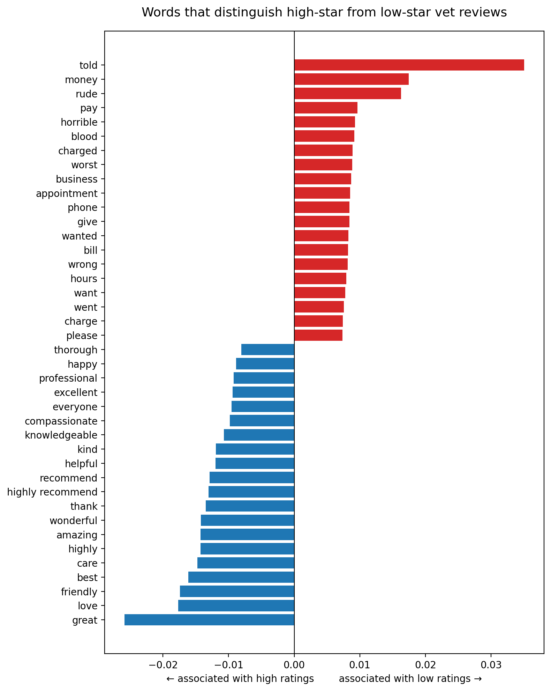

# 🐕 Yelp Veterinary Data Pipeline & NLP Sentiment Mining

A memory-efficient Data Engineering, Text Preprocessing, and Sentiment Analysis pipeline built to ingest multi-gigabyte datasets, extract niche business insights, and visually isolate industry-specific drivers of customer satisfaction.



---

## 🛠️ Tech Stack & Dependencies

* **Language:** Python 3.x
* **Core Libraries:** `pandas`, `numpy`, `matplotlib`, `regex` (`re`), `nltk`, `scikit-learn`
* **Environment:** Designed for Kaggle / Jupyter Notebook environments

---

## ✨ Core Project Architecture

* **Memory-Optimized Data Pipeline:** Uses chunked JSON streaming (`chunksize=100000`) to parse and filter millions of rows without triggering Out-Of-Memory (OOM) errors.
* **Relational ID Slicing:** Leverages Python `set`-based indexing for \(O(1)\) lookups to dynamically extract user interactions (reviews, tips, check-ins) tied to specific businesses.
* **Custom NLP Text Cleansing:** Normalizes text data by removing noise (punctuation, case, numbers) and stripping standard English and domain-specific stopwords (e.g., *dog*, *cat*, *vet*).
* **N-Gram TF-IDF Vectorization:** Constructs high-dimensional sparse matrices using unigrams and bigrams (`ngram_range=(1,2)`) to preserve critical phrases like *"wait time"* or *"front desk"*.
* **Statistical Sentiment Differencing:** Computes a custom mathematical delta vector between average high-star and low-star text reviews.
* **Diverging Analytical Visualizations:** Generates a custom horizontal bar chart plotting statistical keyword variance to visually distinguish operational pain points from consumer praise.

---

## 📊 End-to-End Pipeline Workflow

### Phase 1: Data Isolation & Ingestion (File 1)
1. **Target Identification:** Scans the core Yelp business file to isolate entities explicitly categorized under `'Veterinarian'`.
2. **Relational Extraction:** Uses the unique target IDs to slice secondary datasets (`review.json`, `user.json`, `checkin.json`, `tip.json`), discarding millions of irrelevant rows on-the-fly.
3. **Structured Storage:** Exports five localized, small-footprint CSV files representing the complete veterinary network.

### Phase 2: Feature Engineering & NLP Analytics (File 2)
4. **Vocabulary Capping:** Instantiates a 5,000-feature `TfidfVectorizer` mapping high-signal unigrams and bigrams.
5. **Frequency Boundaries:** Implements strict data pruning boundaries (`min_df=3`, `max_df=0.5`) to auto-drop rare typos and ubiquitous words.
6. **Sentiment Delta Computation:** Splits the dataset into poor (\(\le 2\) stars) and excellent (\(\ge 4\) stars) cohorts, evaluating feature metrics with a custom delta curve:

\[\Delta = \text{Mean}_{\text{Low Rating}}(\text{TF-IDF}) - \text{Mean}_{\text{High Rating}}(\text{TF-IDF})\]

### Phase 3: Insight Representation (File 3)
7. **Vector Alignment:** Sorts the resulting vocabulary matrix by its sentiment delta (\(\Delta\)).
8. **Diverging Chart Generation:** Plots a dual-color horizontal bar chart map (Red for \(\Delta > 0\) complaints, Blue for \(\Delta < 0\) praise).
9. **Asset Generation:** Saves high-resolution, presentation-ready visualizations (`tfidf_diverging_chart.png`) directly into the deployment workspace.

---

## 🚀 Local Replication & Setup

### Prerequisites
Install the required analytical and visualization dependencies:
```bash
pip install pandas numpy matplotlib scikit-learn nltk
```

### Expected Directory Architecture
Ensure your input files are nested within your working path like this:
```text
├── input/
│   └── datasets/
│       ├── organizations/yelp-dataset/
│       │   ├── yelp_academic_dataset_business.json
│       │   ├── yelp_academic_dataset_review.json
│       │   └── ... (remaining yelp files)
│       └── micahluftig/stop-words/
│           └── stop_words.csv
├── pipeline.py
└── tfidf_diverging_chart.png
```

---

## 📈 Key NLP Metrics & Discoveries

* **Positive Delta ($\Delta > 0$):** Highlights structural, managerial, or operational failure points. These keywords explicitly expose what triggers negative reviews (e.g., long wait times, billing discrepancies, lack of empathy).
* **Negative Delta ($\Delta < 0$):** Isolates key drivers of patient retention and positive reviews, pointing directly to clinical excellence, compassionate staff behaviors, and successful medical outcomes.
